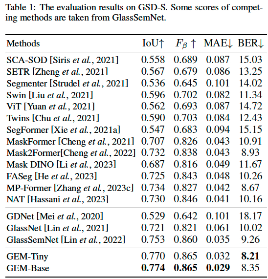

#  GEM: Glass-Segmentor


[Jing Hao](https://scholar.google.com/citations?user=E8R8c00AAAAJ&hl=zh-CN), [Moyun Liu](https://scholar.google.com/citations?user=5gWDxqAAAAAJ&hl=zh-CN), [Jinrong Yang](https://scholar.google.com/citations?hl=zh-CN&user=8Of_NYQAAAAJ), [Kuo Feng Hung](https://scholar.google.com/citations?user=17V5x14AAAAJ&hl=zh-CN).

This repository is the official implementation of the [GEM: Boost Simple Network for Glass Surface Segmentation via Vision Foundation Models](https://arxiv.org/pdf/2307.12018). Our code is based on [MaskDINO](https://github.com/IDEA-Research/MaskDINO/tree/main). 

<!-- 
[Feng Li*](https://fengli-ust.github.io/), [Hao Zhang*](https://scholar.google.com/citations?user=B8hPxMQAAAAJ&hl=zh-CN), [Huaizhe Xu](https://scholar.google.com/citations?user=zgaTShsAAAAJ&hl=en&scioq=Huaizhe+Xu), [Shilong Liu](https://www.lsl.zone/), [Lei Zhang](https://scholar.google.com/citations?hl=zh-CN&user=fIlGZToAAAAJ), [Lionel M. Ni](https://scholar.google.com/citations?hl=zh-CN&user=OzMYwDIAAAAJ), and [Heung-Yeung Shum](https://scholar.google.com.hk/citations?user=9akH-n8AAAAJ&hl=en).

This repository is the official implementation of the [Mask DINO: Towards A Unified Transformer-based
Framework for Object Detection and Segmentation](https://arxiv.org/abs/2206.02777) (DINO pronounced `daɪnoʊ' as in dinosaur). Our code is based on [detectron2](https://github.com/facebookresearch/detectron2). [detrex](https://github.com/IDEA-Research/detrex) version is opensource simultaneously. 


<details close>
<summary> <font size=8><strong>News</strong></font> </summary>


[2023/2] Mask DINO has been accepted to CVPR 2023!

[2022/9] We release a toolbox [**detrex**](https://github.com/IDEA-Research/detrex) that provides state-of-the-art Transformer-based detection algorithms. It includes DINO **with better performance** and Mask DINO will also be released with detrex implementation. Welcome to use it! </br>
  - Supports Now: [DETR](https://arxiv.org/abs/2005.12872), [Deformble DETR](https://arxiv.org/abs/2010.04159), [Conditional DETR](https://arxiv.org/abs/2108.06152), [Group-DETR](https://arxiv.org/abs/2207.13085), [DAB-DETR](https://arxiv.org/abs/2201.12329), [DN-DETR](https://arxiv.org/abs/2203.01305), [DINO](https://arxiv.org/abs/2203.03605).

[2022/7] Code for [DINO](https://arxiv.org/pdf/2203.03605.pdf) is available [here](https://github.com/IDEACVR/DINO)!

[2022/5][DN-DETR](https://arxiv.org/abs/2203.01305) is accepted to CVPR 2022 as an **Oral** presentation. Code is now avaliable [here](https://github.com/IDEA-opensource/DN-DETR).

[2022/4][DAB-DETR](https://arxiv.org/abs/2201.12329) is accepted to ICLR 2022. Code is now avaliable [here](https://github.com/IDEA-opensource/DAB-DETR).

[2022/3]We release a SOTA detection model [DINO](https://arxiv.org/abs/2203.03605) that for the first time establishes a DETR-like model as a SOTA model on the [leaderboard](https://paperswithcode.com/sota/object-detection-on-coco). Code will be avaliable [here](https://github.com/IDEACVR/DINO).

[2022/3]We build a repo [Awesome Detection Transformer](https://github.com/IDEACVR/awesome-detection-transformer) to present papers about transformer for detection and segmentation. Welcome to your attention!
</details>


### Features 

* A **unified** architecture for object detection, panoptic, instance and semantic segmentation.
* Achieve **task and data cooperation** between detection and segmentation.
* **State-of-the-art** performance under the same setting.
* Support major detection and segmentation datasets: COCO, ADE20K, Cityscapes.


### Code Updates

* [2022/12/02] Our code and checkpoints are available! Mask DINO further Achieves <strong>51.7</strong> and <strong>59.0</strong> box AP on COCO with a ResNet-50 and SwinL without extra detection data, **outperforming DINO** under the same setting!

* [2022/6] We propose a unified detection and segmentation model [Mask DINO](https://arxiv.org/pdf/2206.02777.pdf) that achieves the best results on all the three segmentation tasks (**54.7** AP on [COCO instance leaderboard](https://paperswithcode.com/sota/instance-segmentation-on-coco), **59.5** PQ on [COCO panoptic leaderboard](https://paperswithcode.com/sota/panoptic-segmentation-on-coco-test-dev), and **60.8** mIoU on [ADE20K semantic leaderboard](https://paperswithcode.com/sota/semantic-segmentation-on-ade20k))!
-->


<details open>
<summary> <font size=8><strong>Todo list</strong></font> </summary>

- [x] Release code and GEM-Tiny checkpoint

- [x] Release S-GSD dataset

- [x] Release multiple pre-trained models
  
- [x] Release GEM-Base model
</details>


***

### Features 
* A simple but accurate segmentation framework, named **GEM**, for glass surface segmentation.
* Automatically construct a large-scale synthesized glass surface dataset with precise mask annotation, termed **S-GSD**.
* Surpasses the previous state-of-the-art methods by a large margin (IoU +2.1%).


## Installation

See [Mask DINO](https://github.com/IDEA-Research/MaskDINO/blob/main/INSTALL.md).


## Getting Started
<!-- See [Inference Demo with Pre-trained Model](demo/README.md) -->

See [Inference Demo with Pre-trained Model](demo/README.md)

See [Results](#results).

See [Preparing Datasets for GEM](datasets/README.md).

See [Getting Started](#getting-started-1).

<!-- See [More Usage](#more-usage). -->

***

# Results

<table><tbody>
<!-- START TABLE -->
<!-- TABLE HEADER -->
<th valign="bottom">Model</th>
<th valign="bottom">Pre-trained dataset</th>
<th valign="bottom">IoU</th>
<th valign="bottom">F_β</th>
<th valign="bottom">MAE</th>
<th valign="bottom">BER</th>
<th valign="bottom">FPS</th>
<th valign="bottom">download</th>

 <tr><td align="left">GEM-Tiny | <a href="configs/gsd-s/semantic-segmentation/gem_sam_tiny_bs32_iter1w_steplr.yaml">config</a></td>
<td align="center"><a href="https://pan.baidu.com/s/1GnMCKw2Rvt9BoUUvSIWPRw?pwd=jpzb">S-GSD-1x</a></td>    
<td align="center">0.755</td>
<td align="center">0.852</td>
<td align="center">0.038</td>
<td align="center">8.39</td>
<td align="center">16.09</td>
<td align="center"><a href="https://pan.baidu.com/s/1i0i0Q-ewYX4zWMuTuqMGpg?pwd=tr14">BaiduDisk</a></td>
</tr>

 <tr><td align="left">GEM-Tiny | <a href="configs/gsd-s/semantic-segmentation/gem_sam_tiny_bs32_iter1w_steplr.yaml">config</a></td>
<td align="center">S-GSD-5x</td>    
<td align="center">0.757</td>
<td align="center">0.855</td>
<td align="center">0.035</td>
<td align="center">8.54</td>
<td align="center">16.09</td>
<td align="center"><a href="https://pan.baidu.com/s/126FOm3G_FKBHAOv0kuuYyg?pwd=aehh">BaiduDisk</a></td>

</tr>

 <tr><td align="left">GEM-Tiny | <a href="configs/gsd-s/semantic-segmentation/gem_sam_tiny_bs32_iter1w_steplr.yaml">config</a></td>
<td align="center">S-GSD-10x</td>    
<td align="center">0.764</td>
<td align="center">0.866</td>
<td align="center">0.034</td>
<td align="center">8.62</td>
<td align="center">16.09</td>
<td align="center"><a href="https://pan.baidu.com/s/1U5xkf0mhJejgnptq8JqBeQ?pwd=skac">BaiduDisk</a></td>

</tr>

 <tr><td align="left">GEM-Tiny | <a href="configs/gsd-s/semantic-segmentation/gem_sam_tiny_bs32_iter1w_steplr.yaml">config</a></td>
<td align="center">S-GSD-20x</td>    
<td align="center">0.770</td>
<td align="center">0.865</td>
<td align="center">0.032</td>
<td align="center">8.21</td>
<td align="center">16.09</td>
<td align="center"><a href="https://pan.baidu.com/s/1Wo0iOulD6Qd-RLzB-webcg?pwd=5c8j">BaiduDisk</a></td>
</tr>

 <tr><td align="left">GEM-Base | <a href="configs/gsd-s/semantic-segmentation/gem_sam_base_bs16_iter2w_steplr.yaml">config</a></td>
<td align="center"><a href="https://pan.baidu.com/s/1GnMCKw2Rvt9BoUUvSIWPRw?pwd=jpzb">S-GSD-1x</a></td>    
<td align="center">0.766</td>
<td align="center">0.873</td>
<td align="center">0.031</td>
<td align="center">9.44</td>
<td align="center">11.55</td>
<td align="center"><a href="https://pan.baidu.com/s/1-UzfguaIPL-y3VJpITQi7w?pwd=ucgt">BaiduDisk</a></td>
</tr>

 <tr><td align="left">GEM-Base | <a href="configs/gsd-s/semantic-segmentation/gem_sam_base_bs16_iter2w_steplr.yaml">config</a></td>
<td align="center">S-GSD-5x</td>    
<td align="center">0.769</td>
<td align="center">0.858</td>
<td align="center">0.032</td>
<td align="center">8.16</td>
<td align="center">11.55</td>
<td align="center"><a href="https://pan.baidu.com/s/1CBAvC77hZa9tqTo_v3RFCA?pwd=i6ui">BaiduDisk</a></td>

</tr>

 <tr><td align="left">GEM-Base | <a href="configs/gsd-s/semantic-segmentation/gem_sam_base_bs16_iter2w_steplr.yaml">config</a></td>
<td align="center">S-GSD-10x</td>    
<td align="center">0.774</td>
<td align="center">0.868</td>
<td align="center">0.032</td>
<td align="center">8.56</td>
<td align="center">11.55</td>
<td align="center"><a href="https://pan.baidu.com/s/1VAxVmVXb_zphZng0_FMnVg?pwd=6cv8">BaiduDisk</a></td>

</tr>

 <tr><td align="left">GEM-Base | <a href="configs/gsd-s/semantic-segmentation/gem_sam_base_bs16_iter2w_steplr.yaml">config</a></td>
<td align="center">S-GSD-20x</td>    
<td align="center">0.774</td>
<td align="center">0.865</td>
<td align="center">0.029</td>
<td align="center">8.35</td>
<td align="center">11.55</td>
<td align="center"><a href="https://pan.baidu.com/s/1g3swWzY4C6AYYGq2cZVRVQ?pwd=xj3e">BaiduDisk</a></td>
</tr>

</tbody></table>

**[07/15/2024] The sam backbone pre-trained model can download from [Huggingface]([https://huggingface.co/Bryceee/GEM-Glass-Segment-model/tree/main](https://huggingface.co/datasets/Gourieff/ReActor/blob/main/models/sams/sam_vit_b_01ec64.pth))** 

**[07/15/2024] All pre-trained models can also download from [Huggingface](https://huggingface.co/Bryceee/GEM-Glass-Segment-model/tree/main)** 

**[07/18/2024] S-GSD-1x dataset can also download from [Huggingface](https://huggingface.co/datasets/Bryceee/S-GSD)** 


The download link of S-GSD-5x is blow here, it be divided into three parts:

Part1: https://pan.baidu.com/s/1CL0x8s1LXdIIoOjcr5wirw?pwd=2ff4

Part2: https://pan.baidu.com/s/18uCDKFmzy7vSmWm1IF4JFQ?pwd=9jqb

Part3: https://pan.baidu.com/s/1Z8pePl9Ps3QtrZB7WQ7aoQ?pwd=8fku

The S-GSD-10x and S-GSD-20x are not released because of the large disk storage, if you want to get these two large-scale datasets, feel free to contact me via isjinghao@gmail.com.

<!---->

***


***


# Getting Started

In the above tables, the corresponding model checkpoints can pre-trained models can be downloaded from the link.

If your dataset files are not under this repo, you need to add `export DETECTRON2_DATASETS=/path/to/your/data` or use Symbolic Link `ln -s`
to link the dataset into this repo before the following command first.


#### Evalaluate our pretrained models
* You can download our pretrained models and evaluate them with the following commands.
  ```sh
  python train_net.py --eval-only --num-gpus 8 --config-file config_path MODEL.WEIGHTS /path/to/checkpoint_file
  ```
#### Train GEM to reproduce results
* Use the above command without `eval-only` will train the model. For MobileSAM/SAM backbones, you need to download its weight from () and specify the path of the pretrained backbones with `MODEL.WEIGHTS /path/to/pretrained_checkpoint`
  ```sh
  python train_net.py --num-gpus 8 --config-file config_path MODEL.WEIGHTS /path/to/checkpoint_file
  ```
You can also refer to [Getting Started with Detectron2](https://github.com/facebookresearch/detectron2/blob/master/GETTING_STARTED.md) for full usage.


<!-- # More Usage

### Mask-enhanced box initialization

We provide 2 ways to convert predicted masks to boxes to initialize decoder boxes. You can set as follows
* `MODEL.MaskDINO.INITIALIZE_BOX_TYPE: no` not using mask enhanced box initialization
* `MODEL.MaskDINO.INITIALIZE_BOX_TYPE: mask2box`  a fast conversion way
* `MODEL.MaskDINO.INITIALIZE_BOX_TYPE: bitmask`  provided conversion from detectron2, slower but more accurate conversion. 

These two conversion ways do not affect the final performance much, you can choose either way. 

In addition, if you already
train a model for 50 epochs without mask-enhance box initialization, you can plug in this method and simply 
finetune the model in the last few epochs (i.e., load from 32K iteration trained model and finetune it). This way can
also achieve similar performance compared with training from scratch, but more flexible.

### Model components
MaskDINO  consists of three components: a backbone, a pixel decoder and a Transformer decoder.
You can easily replace each of these three components with your own implementation.

* **backbone**: Define and register your backbone under `maskdino/modeling/backbone`. You can follow the Swin Transformer as an example.
  
* **pixel decoder**: pixel decoder is actually the multi-scale encoder in DINO and Deformable DETR, we follow mask2former to call
  it pixel decoder. It is in `maskdino/modeling/pixel_decoder`, you can change your multi-scale encoder. The returned values 
  include 
  1. `mask_features` is the per-pixel embeddings with resolution 1/4 of the original image, obtained by fusing backbone 1/4 features and multi-scale encoder encoded 1/8 features. This is used to produce binary masks.
  2. `multi_scale_features`, which is the multi-scale inputs to the Transformer decoder.
  For ResNet-50 models with 4 scales, we use resolution 1/32, 1/16, and 1/8 but you can use arbitrary resolutions here, and follow DINO to additionally downsample
     1/32 to get a 4th scale with 1/64 resolution. For 5-scale models with SwinL, we additional use 1/4 resolution features as in DINO.

* **transformer decoder**: it mainly follows DINO decoder to do detection and segmentation tasks. It is defined in `maskdino/modeling/transformer_decoder`. -->


## <a name="CitingMaskDINO"></a>Citing GEM

If you find our work helpful for your research, please consider citing the following BibTeX entry.

```BibTeX
@article{hao2024gem,
  title={GEM: Boost Simple Network for Glass Surface Segmentation via Segment Anything Model and Data Synthesis},
  author={Hao, Jing and Liu, Moyun and Hung, Kuo Feng},
  journal={arXiv preprint arXiv:2401.15282},
  year={2024}
}
```

If you find the code useful, please also consider the following BibTeX entry.

```BibTeX
@misc{li2022mask,
      title={Mask DINO: Towards A Unified Transformer-based Framework for Object Detection and Segmentation}, 
      author={Feng Li and Hao Zhang and Huaizhe xu and Shilong Liu and Lei Zhang and Lionel M. Ni and Heung-Yeung Shum},
      year={2022},
      eprint={2206.02777},
      archivePrefix={arXiv},
      primaryClass={cs.CV}
}
```

## Acknowledgement

Many thanks to these excellent opensource projects 
* [Mask DINO](https://github.com/IDEA-Research/MaskDINO)
* [Segment-Anything](https://github.com/facebookresearch/segment-anything)

